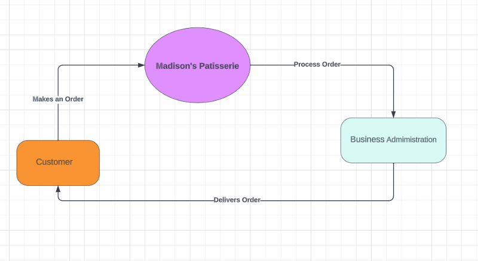
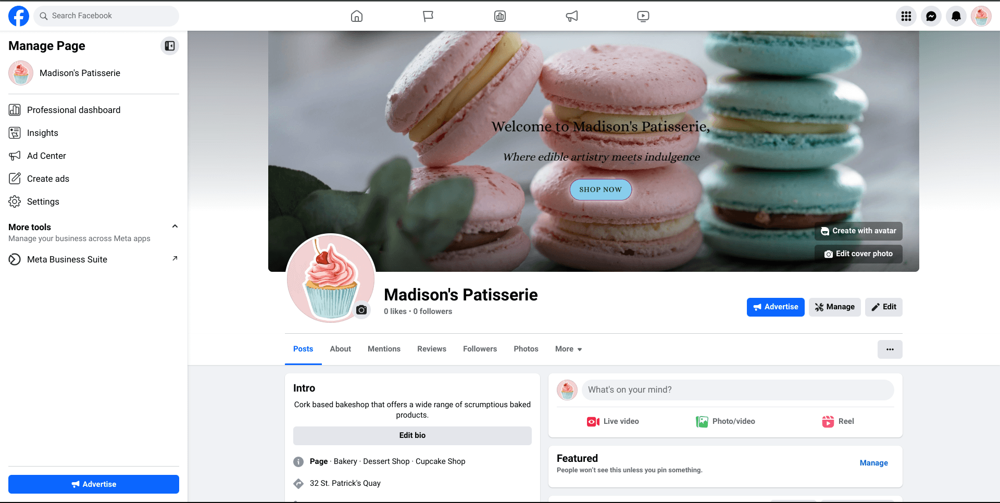
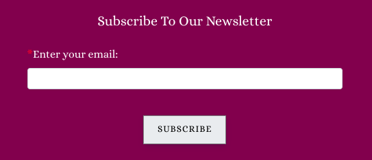
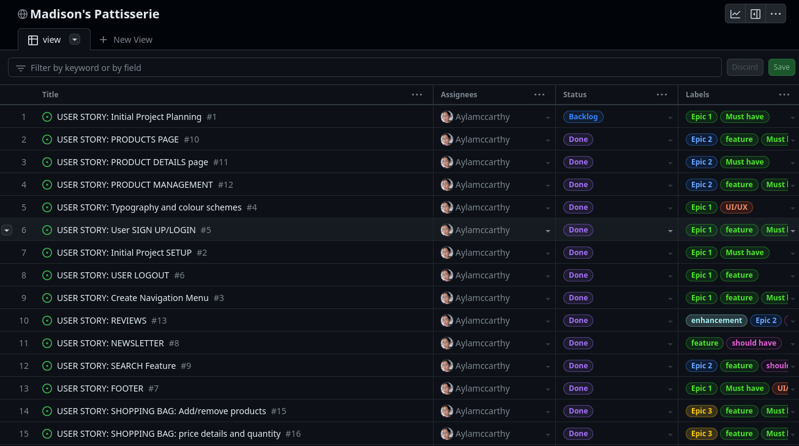
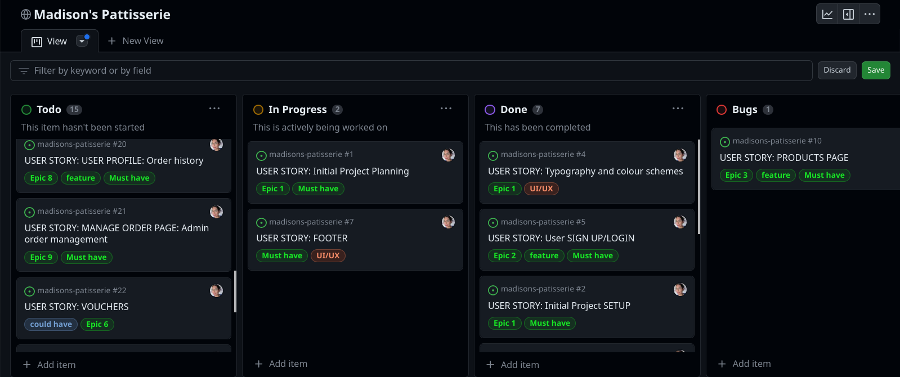

# Madison's Patisserie - Online Bakeshop
<br>
<hr>

<h3 align="center">Full-Stack Project- E-Commerce(HTML5, CSS3, Bootstrap, Django, Python, JavaScript, jQuery, PostgreSQL, AWS, Heroku)</h3>


TABLE OF CONTENTS

  - [Overview](#overview)
  - [UX](#ux)
  - [Business Model](#business-model)
  - [Marketing](#marketing)
  - [Agile Methodology](#agile-methodology)
  - [Features](#features)
  - [Responsive Layout and Design](#responsive-layout-and-design)
  - [Tools Used](#tools-used)
  - [Testing](#testing)
  - [Deployment](#deployment)
  - [Credits](#credits)
  - [Acknowledgements](#acknowledgements)

## Overview
Madison's Patisserie is an e-commerce website created for a fictive bakeshop located in Cork, Ireland. The main purpose of the project was to implement a fully functional online store that will make the process of selecting and purchasing baked products much easier for customers.<br>
The users are given the possibility to see every product's details, create a wishlist, add items to the shopping bag, purchase with an online payment and access orders' history. Also, the staff members have permission for controlling the data using specially designed features.<br>
The website was developed using Python(Django), HTML, CSS and JavaScript. The data was stored in a PostgreSQL database using ElephantSql for manipulation.
<br><br>
The fully deployed project can be accessed at [this link]().<br><br>

## UX
This site was created respecting the Five Planes Of Website Design:<br>
### Strategy<hr>
**User Stories:** <br>

|   EPIC                                ||                                User Story                                                   |
| :-------------------------------------|--|:------------------------------------------------------------------------------------------- |
|**VIEWING AND NAVIGATION**             |  ||
|                                       || As a user, I want to understand the purpose of the website from the first interaction with its content |             
|                                       || As a user, I want to be able to easily use the site functionalities on all viewports, so I can shop the products from any device|
|                                       || As a user, I want to see a footer with relevant information and documents|
|                                       || As a user, I want to be able to access a navigation menu at any time, so I can easily navigate through the website content|
|                                       || As a user, I want to be able search through site products by entering a key word|
|**USER REGISTRATION/AUTENTHICATION**   |  || 
|                                       || As a user, I want to be able to register on the website|
|                                       || As a user, I want to be able to confirm my account with an email|
|                                       || As a user/admin, I want to be able to authenticate using only email and password|
|                                       || As a user, I want to be able to reset my password in case I forgot it|
|                                       || As a user/admin, I want to be able to log out at any time|
|**PRODUCTS**                           |  ||
|                                       || US - As a user, I want to see a catalog with all the products and also grouped by categories|
|                                       || US - As a user, I want to be able to apply filters and to sort the listed products, so I can easily find the ones I am interested to buy|
|                                       || US - As a user, I want to be able to see the stock availability for low stock products|
|                                       || US - As a user, I want to see a page with full specifications for every product, so I can easily decide which one I would want to buy|
|                                       || US - As a user, I want to be able to add any product to the shopping bag in a selected quantity|
|                                       || US - As an admin, I want to be able to edit product details|
|                                       ||  US - As an admin, I want to be able to delete products from the catalog, so it reflect the existent stock|
|                                       || US - As an admin, I want to be able to add new products to catalog, so it reflects the existent stock|
|**REVIEWS**                            |  ||
|                                       || US - As a user, I want to be able to see all the reviews added for any product, so I can easily make an opinion about its quality|
|                                       || US - As a logged in user, I want to be able to add a review for any product I want|
|                                       || US - As a logged in user, I want to be able to see and edit my reviews added to products|
|                                       || US - As a user, I want to be able to see a general review of every product|
|**WISHLIST**                           |  ||
|                                       || US - As a logged-in user, I want to be able to add/remove any product from the Wishlist|
|                                       || US - As a logged-in user, I want to see all the products added to Wishlist|
|                                       || US - As a logged-in user, I want to be able to apply filters and to sort the products in the Wishlist|
|                                       || US - As a logged-in user, I want to be able to add products to the shopping bag from the Wishlist page|
|                                       || US - As a user, I want to see how many times a product has been added to Wishlist by all the users|        
|**BAG**                                |  ||
|                                       || US - As a user, I want to see all the products I added to the shopping bag|
|                                       || US - As a user, I want to be able to add/remove from the wishlist any product from the shopping bag|
|                                       || US - As a user, I want to see all the details about the price for the order|
|                                       || US - As a user, I want to be able to remove a product from the shopping bag|
|                                       || US - As a user, I want to be able to edit the quantity of the products|
|                                       || US - As a user, I want that all the discounts announced on the website to be applied properly|
|                                       || US - As a user, I want to be able to add my vouchers to the order|
|**CHECKOUT**                           |  ||
|                                       || US - As a logged-in user, I want to be able to see and edit my default delivery details for the order|
|                                       || US- As a user, I want to see the order summary with all the price details|
|                                       || US - As a user, I want to be able to add my delivery details for the order|
|                                       || US - As a user I want to be able to introduce my card details for payment|
|**USER PROFILE**                       |  ||
|                                       || US - As a logged in user, I want to be able to see and edit my delivery details|
|                                       || US - As a logged-in user, I want to be able to see my orders history|
|                                       || US - As a logged-in user, I want to see the full details for every order I placed on the website|
|**ADMIN MANAGE ORDERS**                |  ||
|                                       || US - As an admin, I want to be able to see all the orders placed on the website grouped by date|
|                                       || US -As an admin, I want to be able to filter the orders by date|
|                                       || US -As an admin, I want to see full details of every order placed on the website|
|**NEWSLETTER**                         |  ||
|                                       || US - As a user, I want to be able to subscribe to a newsletter, so I can always be up to date with the latest promotions|


**Project Goal:**<br>
Create an e-commerce application for Madison's Patisserie Bakeshop that is useful for clients and staff members as well.

**Project Objectives:**<br> 
* To create a website with a simple and intuitive User Experience;
* To add content that is relevant and helps create a better image of the bakeshop;
* To differentiate between client and staff member accounts;
* To implement fully functional features that will ease the staff members' tasks and upgrade clients' experience with the bakeshop's products;
* To make a fully responsive website available and functional on every device.<br><br>

### Scope <hr>
**Simple and intuitive User Experience**<br>
* Ensure the navigation menu is visible and functional at every step;
* Ensure every page has a suggestive name that fits its content;
* Ensure the users will get visual feedback when navigating through pages;
* Create a design that matches the requirements of an e-commerce website.

**Relevant content**<br>
* Add a representative cover image;
* Add the website title and details about its purpose;
* Add a section that includes information about the shop's name, description, location and contact details;
* Make a clear and beautiful designed presentation of the menu elements;

**Features for upgraded experience**<br>
* Create a list with all the products and group them by category;
* Create a Bag feature that allows the user to add, update and remove products from the shopping bag;
* Create a Wishlist feature that gives the user the possibility to add and remove items from the wishlist;
* Create a Review feature that displays all the reviews added for a product and allows the user to add and edit his review;
* Create a Checkout feature for giving the user the possibility to complete an order on the website;
* Create a Profile page for the user to add/update his delivery details and see his orders' history;
* Create a Newsletter feature that allows the user to subscribe with his email;
* Create a Voucher feature that offers the user a dicount code on account registration;
* Create a page for the staff members to manage all the orders for all the users;
* Create a feature for the staff members to add/edit products on the website;

**Different client and staff member Accounts**<br>
* Allow the clients to add/edit reviews and the staff members only the option to read them;
* Give the client permission to add/remove products from wishlist and remove the feature for staff members;
* Only guest and client users to access the shopping bag and its features;
* Only guest and client users can make an order on the website;
* Give permission only for staff members to add/edit products; 
* Allow access to Profile page only for clients users;
* Allow access to Wishlist page only for clients users;
* Allow access to Orders page only for staff member users;

### Structure<hr>
The structure of the website is divided into multiple pages and the content is displayed depending on authentication and client/admin type of user. <br>
- **Register/Login** pages give the user the possibility to create an account and authenticate for accessing different features.<br>
- **Logout** feature is a modal that helps user exit their current account;<br>
- The **Home** page is visible for both types of users and includes relevant information about the websites' purpose and details a bout the bakeshop, location and contact;<br>
-The **All products** page displays a list with all the products available for selling;<br>
- The **Cakes** navigation link gives the user the possibility to access the list of products grouped by category, <b>Fresh Cream Cakes</b>, <b>Buttercream Cakes</b>, <b>Drip Cakes</b> and <b>Celebration Cakes</b>;<br>
- The **Celebration/Occassion Cakes** page lists the products categorised as <em>Birthday</em>, <em>Wedding</em> and <em>Custom Made Cakes</em>;
- The **Product details** page displays full specifications for a product and gives access to the <b>Review</b> feature. It also includes a feature for updating the shopping bag for users that are not admins. Staff members have access to the feature for editing/removing current product;<br>
- The **Profile** page is only available for authenticated users that are not admins and gives access to personal delivery details and orders' history;<br>
- The **Profile order details** page gives access to the user to full specifications only for orders placed by him.<br>
- The **Wishlist** page contains a list with all the products added by the user and cannot be accessed by guest or admin users;<br>
- The **Bag** page displays all the items added in the shopping bag with associated features;<br>
- The **Checkout page** includes an order summary and a form for personal, delivery and payment details;<br>
- The **Checkout success** page displays full specification for the successful order;<br>
- The **Orders** page gives access only to staff members and displays all the bookings registered, grouped and filtered by day.<br>
- The **Admin order details** page gives access only to staff members to full specifications for any order.<br>

* FLOWCHARTS<br>
The Flowchart for my program was created using <b>LucidChart</b> and it visually represents how the system works.<br>
[]()<br><br>

### Skeleton<hr>
**Wireframes**<br>
The wireframes for mobile and desktop were created with [Balsamiq](https://balsamiq.com/) tool and can be viewed [here]<br>

**Database**<br>
The project uses the PostgreSQL relational database for storing the data.<br>

<details>
  <summary>Initial Schema</summary>
<br>
</details>

<details>
  <summary>Final Schema</summary>
<br>
</details><br>

### Surface<hr>
#### Color Scheme
All the colours were selected generated from the hero image using Coolors
<br>

#### Fonts
* The fonts I used for this site were imported from [Google Fonts](https://fonts.google.com/):<br>
**Body:** *Alice, serif*<br>
**Logo:** *Yesteryear, cursive*<br>
**Custom error page:** *Josefin Sans, sans-serif*

#### Visual Effects
* **Box shadows** <br>

* **Hover effects**<br>

* **Animation**<br>

## Business Model

* The business model chosen for this project is <b>Business to Customer</b>, as the main purpose of the website is to deliver final products to customers. This model was implemented using an interactive, attractive and intuitive interface that gives the clients an upgraded experience for shopping.<br><br>


* The store offers a diverse selections of baked products categorised as *All Products*, *Cakes*(Cakes are further sub-categorised to drip cakes, buttercream cakes, chocolate cakes and occassion cakes), *Desserts*, *Sweet Treats* and *Everyday Esssentials*. Customers can order any quantity of the products within the limit of available stock.

## Marketing

### Facebook Page
* The marketing strategy includes a Facebook business page that is intended to create a good image of the bakeshop by posting news and promotions available. By highly promoting the products and always adding new content, the page will increase its popularity and attract more and more customers to buy from the online store. The page can be accessed at [this link](https://www.facebook.com/profile.php?id=61553025716191).<br><br><br><br>


### Newsletter
* Newsletter is also utilised as a marketing strategy in an attempt to improve customer engagement further, keeping them up to date and also incentivising them by running promotions on regular basis.<br><br>


## Agile Methodology
This project was developed utilising the Agile Methodogy.<br>
 I prioritized features by labeling them such as "must-have", "could-have", "future enhancement", "backlog" and "bugs" among others and moved some less critical ones to future development. To guide my development process, I created user stories for both the admin/staff user and guests/clients/customers. These stories helped to define the features and functionalities that were most important to project's target audience.

As a student solo developer who was learning a lot during development, I faced challenges in estimating the time required for each task and only had a basic concept of what I would be able to create at a given timeframe. Therefore, I kept things simple and focused on achievable goals. Aiming for Minimum Viable Product, or MVP. All the features and functionalities that I wanted to have but I didn't manage to finish because of time constraints were moved to "Future Enhancement". With the goal of implementing them on the projects future release.

To keep track of progress, I used Github Projects(https://github.com/users/Aylamccarthy/projects/5). I used a kanban board (https://github.com/users/Aylamccarthy/projects/5/views/1?layout=board) divided into following sections: "to do", "in progress" "done", "backlog", "future enhancements" and "bugs" that allowed me to visualize all tasks and prioritize next steps. However, I could not find the "epics" feature in GitHub Projects, only milestones (it provides only [milestones and issues](https://docs.github.com/en/issues/tracking-your-work-with-issues/about-issues)). Epics are supposed to be larger in scope than milestones, representing a significant amount of work. Milestones, on the other hand, are meant to mark significant points in time in terms of project completion. In this document, I added epics, but on the project board, I used only [milestones]() to stay in order with GitHub's features.

By using Agile methodology, I was able to stay organized, work efficiently and focused on delivering the most important features, while also allowing flexibility for future development. This experience gave me invaluable insight and lessons that I can apply to future projects.


<br> <br>



| Epic | Milestone | User stories |
|------|-----------|--------------|
| Epic 1: BASIC SITE FUNCTIONALITY| Milestone 1: Project SetUp |  [#1](https://github.com/Aylamccarthy/madisons-patisserie/issues/1) [#2](https://github.com/Aylamccarthy/madisons-patisserie/issues/2)
|  |Milestone 2: Content and Navigation |[#3](https://github.com/users/Aylamccarthy/projects/5?pane=issue&itemId=38882996) [#4](https://github.com/users/Aylamccarthy/projects/5?pane=issue&itemId=38883390) 
|   |Milestone 3: User Registration/Authentication   | [#5](https://github.com/users/Aylamccarthy/projects/5?pane=issue&itemId=38883534)  [#6](https://github.com/users/Aylamccarthy/projects/5?pane=issue&itemId=38884037) [#7](https://github.com/Aylamccarthy/madisons-patisserie/issues/7)
| Epic 2: USER MANAGEMENT| Milestone 4 : Products | [#10](https://github.com/Aylamccarthy/madisons-patisserie/issues/10) [#11](https://github.com/Aylamccarthy/madisons-patisserie/issues/11)
|   |Milestone 5: Reviews | [#12](https://github.com/Aylamccarthy/madisons-patisserie/issues/12) [#13](https://github.com/Aylamccarthy/madisons-patisserie/issues/13)
|   |Milestone 6: Wishlist | [#14](https://github.com/Aylamccarthy/madisons-patisserie/issues/14) [#9](https://github.com/Aylamccarthy/madisons-patisserie/issues/9)
| Epic 3: CONTENT MANAGEMENT| Milestone 8: Bag  | [#15](https://github.com/Aylamccarthy/madisons-patisserie/issues/15) [#16](https://github.com/Aylamccarthy/madisons-patisserie/issues/16)
|   |Milestone 9: Checkout | [#17](https://github.com/Aylamccarthy/madisons-patisserie/issues/17) [#18](https://github.com/Aylamccarthy/madisons-patisserie/issues/18)
| Epic 4: USER PROFILE and ADMIN| Milestone 9: User Profile| [#19](https://github.com/Aylamccarthy/madisons-patisserie/issues/19) [#20](https://github.com/Aylamccarthy/madisons-patisserie/issues/20)
|   |Milestone 10:Admin Manage Orders| [#21](https://github.com/Aylamccarthy/madisons-patisserie/issues/21) [#22](https://github.com/Aylamccarthy/madisons-patisserie/issues/22) [#23](https://github.com/Aylamccarthy/madisons-patisserie/issues/23)
| Epic 5: COMPREHENSIVE TESTING and PROJECT WRAP UP| Milestone 11: Comprehensive Testing and Code Validations| [#8](https://github.com/Aylamccarthy/madisons-patisserie/issues/8) [#24](https://github.com/Aylamccarthy/madisons-patisserie/issues/24)
|   | Milestone 12: Refactoring and Final deployment| [#25](https://github.com/Aylamccarthy/madisons-patisserie/issues/25) [#26](https://github.com/Aylamccarthy/madisons-patisserie/issues/26)
|   


## Deployment

The app was deployed to heroku for the first time as soon as  django 
installation was completed to make sure that everything is working correctly.

## Database (ElephangSQL)

1. Navitate to [ElephantSQL website](https://www.elephantsql.com/), log in to your account
2. In top-right corner click on green button "Create New Instance".
3. Enter database name, leave plan field as is, optionaly enter tags.
4. Select region, click on "Review" and then on "Create instance".
5. Go to your dashboard, find newly created database instance, click on it.
6. Copy URL starting with "postgress://"
7. Paste this URL into env.py file as DATABASE_URL value and save the file.

  ```python
  os.environ["DATABASE_URL"] = "postgres://yourLinkFromDatabaseDashboard"
  ```

## AWS

Amazon web services are used to store all static and media files. 

#### S3
1. First you will need to sign up to AWS which you can do [here](https://aws.amazon.com/).
2. Once you have created an account and logged in, under the All Services>Storage menu, click the link that says S3.
3. On the S3 page you will need to create a new bucket. To do this click the orange button that says 'Create Bucket'.
4. Name the bucket and select the closest region to you. To keep things simple I recommend naming the bucket after your project's name.
5. Under 'Object Ownership' select 'ACLs enabled' and leave the Object Ownership as Bucket owner preferred. 
6. Uncheck the 'Block all public access' checkbox and check the warning box to acknowledge that the bucket will be made public, then click create bucket. 
7. Once created, click the bucket's name and navigate to the properties tab. Scroll to the bottom and under 'Static website hosting' click 'edit' and change the Static website hosting option to 'enabled'. Copy the default values for the index and error documents and click 'save changes'.
8. Now navigate to the permissions tab, scroll down to the Cross-origin resource sharing (CORS) section, click edit and paste in the following code:  
    ```
    [
        {
            "AllowedHeaders": [
            "Authorization"
            ],
            "AllowedMethods": [
            "GET"
            ],
            "AllowedOrigins": [
            "*"
            ],
            "ExposeHeaders": []
        }
    ]
    ```
9. Then scroll back up to the 'Bucket Policy' section. Click 'edit' and then 'Policy generator'. This should open the AWS policy generator page.
10. From here under the 'select type of policy' dropdown menu, select 'S3 Bucket Policy'. Then inside 'Principle' allow all principals by typing a *.
11. From the 'Actions dropdown menu select 'Get object'. Then head back to the previous tab and locate the Bucket ARN number. Copy that, return to the policy generator and paste it in the field labelled Amazon Resource Name (ARN).
12. Once that's completed click 'Add statement', then 'Generate Policy'. Copy the policy that's been generated and paste it into the bucket policy editor.
13. Before you click save, add a '/*' at the end of your resource key. This is to allow access to all resources in this bucket.
14. Once those changes are saved, scroll down to the Access control list (ACL) section and click 'edit'.
15. Next to 'Everyone (public access)', check the 'list' checkbox. This will pop up a warning box that you will also have to check. Once that's done click 'save'. 


## Django secret key

In order to protect django app secret key it was set as anviroment variable and stored in env.py. Please change your password accordingly.

```python
os.environ["SECRET_KEY"] = "yourSecretKey"
```

## GitHub and Gitpod

Note: Repository was created using Code Institute template: [https://github.com/Code-Institute-Org/gitpod-full-template](https://github.com/Code-Institute-Org/gitpod-full-template)

1. Login to Github and navigate to repository: [https://github.com/Aylamccarthy/madisons-patisserie](https://github.com/Aylamccarthy/madisons-patisserie)

2. Click on "Fork button" in upper-right corner and create a new form in your own account.

3. Open your repository in local IDE or using Gitpod. Preferred way is to used [Chrome Gitpod Extension](https://chrome.google.com/webstore/detail/gitpod-always-ready-to-co/dodmmooeoklaejobgleioelladacbeki). When you install extension, green "Gitpod" button appears in your repository. Click on it to cread new workspace.

4. Go to workspace terminal and install all requirements using command: "pip install -r requirements.txt". All te packages will be installed. requirements.txt content:

```text
asgiref==3.7.2
black==23.9.1
boto3==1.28.50
botocore==1.31.50
click==8.1.7
coverage==7.3.2
dj-database-url==0.5.0
Django==3.2.21
django-allauth==0.41.0
django-countries==7.5.1
django-mathfilters==1.0.0
django-phonenumber-field==7.2.0
django-phonenumbers==1.0.1
django-resized==1.0.2
django-storages==1.14
django-url-tools==0.0.8
django-url-tools-py3==0.2.1
gunicorn==21.2.0
humanhash3==0.0.6
jmespath==1.0.1
oauthlib==3.2.2
pathspec==0.11.2
phonenumbers==8.13.23
Pillow==10.0.1
psycopg2==2.9.7
python3-openid==3.2.0
requests-oauthlib==1.3.1
s3transfer==0.6.2
sqlparse==0.4.4
stripe==7.0.0
urllib3==1.26.16
```

5. Local env.py file should be configured as on example below:

```python
import os

    # Env vars
    os.environ["DATABASE_URL"] = "postgres://yourLinkCopiedFromElephantSQLDashboard"
    os.environ["SECRET_KEY"] = "YourSecretKey"
    os.environ["AWS_ACCESS_KEY_ID"] = "YourAwsAccessKeyId"
    os.environ["AWS_SECRET_ACCESS_KEY"] = "YourAwsSecretAccessKey"
```

6. In order to save django changes in database migration needs to be made.

7. Use terminal commands:

    ```text
    python3 manage.py makemigrations --dry-run
    python3 manage.py makemigrations
    python3 manage.py migrate --plan
    python3 manage.py migrate
    ```

8. Create superuser to access admin area using terminal command (email is optional, password won't be visible when typing, confirm password twice):

    ```text
    python3 manage.py createsuperuser
    ```

9. App can be run in gitpod enviroment using terminal command:

    ```text
    python3 manage.py runserver
    ```

10. Go to Heroku and follow further instructions below.


### Deploy on Heroku

## Heroku

1. Navigate to [https://heroku.com/](https://heroku.com/) login to your account and open dashboard. Click button "New" and select "Create new app" button.

2. Enter app name, I used "madisons-patisserie", chose your region and click on "Create app" button.

3. Click on newly created app and go to "Deploy" tab and then to "Deployment method" section. Authorize and connect your GitHub account, then find and select your repository.

4. Go to the "Settings" tab, click on "Reveal Config Vars" and add the following keys and values (all values should be strings without any quotation marks):

NOTE: DISABLE_COLLECTSTATIC variable should be set to "1" for initial deployment. Before final deployment it should be removed.

    | Key                    | Value                                                            |
    |------------------------|------------------------------------------------------------------|
    | AWS_ACCESS_KEY_ID      | aws url beginning with aws://                      |
    | DATABASE_URL           | postgress url beginning with postgress://                        |
    | DISABLE_COLLECTSTATIC  | 1                                                                |
    | PORT                   | 8000                                                             |
    | SECRET_KEY             | YourSecretKey, the same as in env.py                             |


5. Return to your Gitpod workspace and navigate to the file `madisons_patisserie.settings.py`. Change allowed hosts including the name of the app that you created in previous steps. In my case, it was 'madisons-patisserie-8790c4325233.herokuapp.com/'. Save the file.

6. Procfile required to run project on Heroku was already created but if you change your app's name please make sure that this change is reflected in Procfile. It can be found in your project's main directory. In my case Procfile looks as below:

    ```python
    web: gunicorn madisons_patisserie.wsgi:application
    ```

7. After adding enviromental variables and editing Procfile project is ready for deployment. In Heroku app's dashboard navigate to "Deploy" tab, scroll down to "Manual deploy" section. Select main branch from dropdown menu and click on "Deploy Branch".

8. **Step required for final deployment:** Navigate again to app's settings, reveal config vars and delete DISABLE_COLLECTSTATIC entry if it was set before.

9. After build is done, you should be able to see the button with the link leading to deployed app. In my case [https://madisons-patisserie-8790c4325233.herokuapp.com/](https://madisons-patisserie-8790c4325233.herokuapp.com/).


### Fork the repository
For creating a copy of the repository on your account and change it without affecting the original project, use<b>Fork</b> directly from GitHub:
- On [My Repository Page](https://github.com/Aylamccarthy/madisons-patisserie), press <i>Fork</i> in the top right of the page
- A forked version of my project will appear in your repository<br></br>

### Clone the repository
For creating a clone of the repository on your local machine, use<b>Clone</b>:
- On [My Repository Page](https://github.com/Aylamccarthy/madisons-patisserie), click the <i>Code</i> green button, right above the code window
- Chose from <i>HTTPS, SSH and GitClub CLI</i> format and copy (preferably <i>HTTPS</i>)
- In your <i>IDE</i> open <i>Git Bash</i>
- Enter the command <code>git clone</code> followed by the copied URL
- Your clone was created
<hr>

