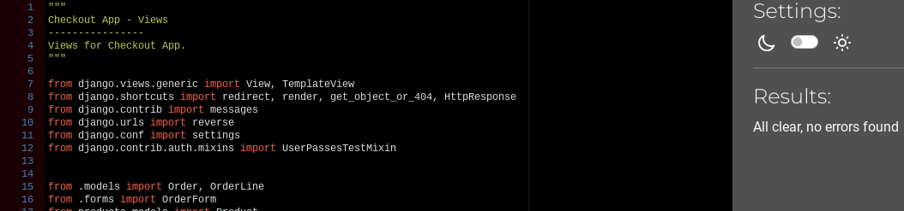
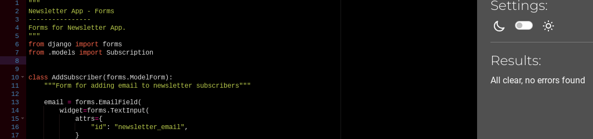
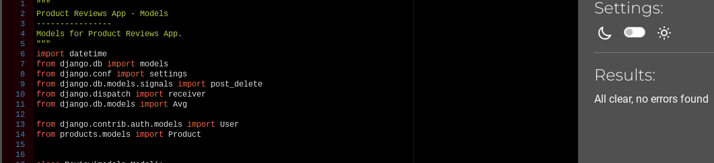
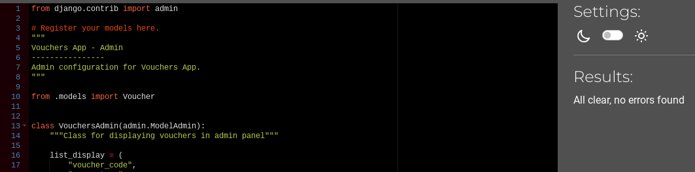

# Testing

Back to [README.MD](README.md) 

## Table of contents
* [User Story and Feature Testing](#user-story-and-feature-testing)
* [Automated View Testing](#automated-view-testing)
* [Browser Testing](#browser-testing)
* [Code Validation](#code-validation)
* [Bugs](#bugs)

## User Story and Feature Testing
All the user stories were tested manually comprehensively, including all the representative features, and were documented below with a summary of the steps made for demonstrating the validation of the tests:  

### EPIC - VIEWING AND NAVIGATION
#### 1A: US - As a user, I want to understand the purpose of the website from the first interaction with it
* **Acceptance Criteria:** A site user should see information about the promoted bakeshop and its products.
* **Summary:** 
    - When a user first navigate the site, he is redirected to the home page where the purpose of the site is described; 
    - The home page contains a cover with an image that suggests what products are being sold; 
    - The title that exists on the cover clarifies that the website is made for selling baked products; 
    - A 'shop now' button is created to attract the user to click on it and redirected to the products page; 
    - There is also a suggestive slogan to further inform the user what the website is about.
    - There is also a short description with details about the bakeshop, and an image of the Bakeshop Cafe.  

    *By testing all these features, it can be affirmed that the user story is accomplished.* 
* **Outcome:** Pass

#### 1B: US - As a user, I want to be able to easily use the site functionalities on all viewports, so I can shop the products from any device
* **Acceptance Criteria:** A user should be able to see a nice design responsive to all devices.
* **Summary:**   
    - The website's features are functional on all types of devices; 
    - The headers have been adapted to fit the smaller devices' screens; 
    - The forms' inputs have been adapted to fit the smaller devices' screens.  

    *By testing all these features, it can be affirmed that the user story is accomplished.* 
* **Outcome:** Pass

#### 1C: US - As a user, I want to see a footer with all relevant information present.
* **Acceptance Criteria:** A user should see relevant information and important documents that clarify privacy aspects. 
* **Summary:** 
   - The footer contains link to <em>All products page;</em> 
   - The footer contains link to <em>Privacy And Policy</em> document for the website; 
   - The footer contains link to <em>Terms & Conditions</em> document for the website; 
   - The footer contains links to different social media pages.  

    *By testing all these features, it can be affirmed that the user story is accomplished.* 
* **Outcome:** Pass   

#### 1D: US - As a user, I want to be able to access a navigation menu at any time, so I can easily navigate through the website content
* **Acceptance Criteria:** A site user should always have access to the navigation menu so he can easily switch between pages at any time.
* **Summary:** 
    - When a user visits the website he can easily see the navigation menu at the top of the page; 
    - Even if switching the pages, the navigation menu is always present and indicates what page is active; 
    - The navigation menu is set to sticky so it is always fixed on the top of the page; 
    - For logged-in users, the menu contains an additional page, <em>My Profile</em>, and <em>Logout</em> link replaces <em>Register</em> and <em>Login</em> pages; 
    - For logged-in staff members, the navigation includes <em>Orders</em>Orders, instead of <em>Profile</em>, as well as <em>Add a new product</em> link.  

    *By testing all these features, it can be affirmed that the user story is accomplished.* 
* **Outcome:** Pass 

#### 1E: US - US - As a user, I want to be able to search through site products by entering a keyword
* **Acceptance Criteria:** A site user should be able to use the search feature for filtering through site products.
* **Summary:** 
    - A search bar is present at any time on the top navigation header; 
    - The user can enter and submit any keyword;  
    - The websites display only the products that contain in their description the keyword entered by the user, or an informative text if no product matches the search query;   

    *By testing all these features, it can be affirmed that the user story is accomplished.* 
* **Outcome:** Pass 

### EPIC - USER REGISTRATION/AUTHENTICATION
#### 2A: US - As a user, I want to be able to register on the website
* **Acceptance Criteria:** A site user should be able to create an account by filling in a form on the website.
* **Summary:** 
    - There is a Register page that provides a form with email, username and password for the user to fill in; 
    - When the user submits the form he is redirected to a page that informs him that he needs to verify his email to finalize the signup process; 
    - An info alert is displayed with the message "Confirmation e-mail sent to..." that suggests the user needs to verify his email.  

    *By testing all these features, it can be affirmed that the user story is accomplished.*  
* **Outcome:** Pass 

#### 2B: US - As a user, I want to be able to confirm my account with an email
* **Acceptance Criteria:** A site user should be able to confirm his account using his email.
* **Summary:** 
    - An email is sent to the user when he tries to register on the page; 
    - The email includes a link that will redirect him to a page from the shop website where he can confirm the email by clicking on a button.  

    *By testing all these features, it can be affirmed that the user story is accomplished.*  
* **Outcome:** Pass

#### 2C: US - As a user/admin, I want to be able to authenticate using only email and password
* **Acceptance Criteria:** A site user should be able to authenticate at any time with email and password.
* **Summary:**  
    - There is a Login page that provides a form with email and password to be filled;  
    - The authentication form has a "Remember me" checkbox that will keep the user logged in;  
    - A success alert is displayed with the message "Logged in as..." that confirms to the user that he has been logged in successfully.    
    
    *By testing all these features, it can be affirmed that the user story is accomplished.*  
* **Outcome:** Pass

#### 2D: US - As a user, I want to be able to reset my password in case I forgot it
* **Acceptance Criteria:** A site user should be able to reset his password with his email.
* **Summary:**    
    - On the <em>Login</em> page there is a clickable link with the text <em>Forgot password?</em>; 
    - The link redirects the user to a page where he can enter the email address where he wants to receive the email for resetting the password; 
    - An email is sent to the specified address with a link; 
    - The link redirects the user to a page on the shop website where he can enter and submit the new password; 
    - The user can now authenticate with the updated password.   
    
    *By testing all these features, it can be affirmed that the user story is accomplished.*  
* **Outcome:** Pass

#### 2E: US - As a user/admin, I want to be able to log out at any time
* **Acceptance Criteria:** A site user should be able to exit the current account at any time.
* **Summary:**    
    - There is a Logout modal that can be triggered when clicking on the hyperlink in the navbar. The modal is implemented as part of a defensive programming;  
    - The logout modal asks the user again if he wishes to log out of the current account;  
    - A success alert is displayed with the message "Logged out" that confirms to the user that he has been successfully logged out.   
    
    *By testing all these features, it can be affirmed that the user story is accomplished.* 
* **Outcome:** Pass

### EPIC - PRODUCTS
#### 3A: US - As a user, I want to see a catalogue with all the products and also grouped by categories
* **Acceptance Criteria:** A user should be able to access a page with all the products, and other pages for every category.
* **Summary:**  
   - In the navigation menu there are separate links that redirect the user to the products' catalogue. These links are classified as: <em>All products</em>, <em>Cakes</em>, <em>Everday Essentials</em>, <em>Sweet Treats</em> and <em>Desserts</em>;  

    *By testing this feature, it can be affirmed that the user story is accomplished.*  
* **Outcome:** Pass

#### 3B: US - As a user, I want to be able to apply filters and sort the listed products, so I can easily find the ones I am interested to buy
* **Acceptance Criteria:** A user should be able to apply filters for different types of wine selections.
* **Summary:** 
   - On the pages that contain a list of products, there is a filtering section on the top of the page;<em>
   - Every filter is a dropdown with the values corresponding to the list of wines displayed; 
   - When a user chooses a value for filtering, the active filter is removed from the filters' list and added to a list of active filters; 
   - Any applied filter can be cancelled and the list of products will be displayed only considering the active filters; 
   - There is a button for removing all the filters at once; 
   - There is also a select input for sorting the products; 
   - All sorting options work properly; 

    *By testing all these features, it can be affirmed that the user story is accomplished.*  
* **Outcome:** Pass

#### 3C: US - As a user, I want to be able to see the stock availability for low-stock products
* **Acceptance Criteria:** A user should see a banner with text that informs him about the product's availability.
* **Summary:** 
    - Every product that is in low stock contains a banner element with information about its value; 
    - The banner is also visible on the product's details page;  

    *By testing all these features, it can be affirmed that the user story is accomplished.*  
* **Outcome:** Pass

#### 3D: US - As a user, I want to see a page with full specifications for every product, so I can easily decide which one I would want to buy
* **Acceptance Criteria:** A user should have access to every product's full description
* **Summary:** 
    - Every item listed on products' pages is clickable and it redirects to the selected product's details page; 
    - The details page includes the product's name, price, and a short description of the product;  

    *By testing all these features, it can be affirmed that the user story is accomplished.*  
* **Outcome:** Pass

#### 3E: US - As a user, I want to be able to add any product to the shopping bag in a selected quantity
* **Acceptance Criteria:** A user should be able to select the quantity value and add any product to the shopping bag.
* **Summary:** 
   - There is a container with input for quantity and an <em>Add to bag</em> button on every element listed in products pages; 
   - There is a container with input for quantity and an <em>Add to bag</em> button on every product detail page; 
   - The quantity input has validation that doesn't allow the user to insert and submit a value greater than the stock value or smaller than 1;  
   - When a product is added to the shopping bag an alert is triggered with the success message "Added ... to your bag" 
   - When the same product is added to the shopping bag, only the quantity value is updated and an alert is triggered with the success message "Updated ... quantity to ...".  

    *By testing all these features, it can be affirmed that the user story is accomplished.*  
* **Outcome:** Pass

#### 3F: US - As an admin, I want to be able to edit product details 
* **Acceptance Criteria:** An admin user should have access to a form to update specifications for any product.
* **Summary:** 
    - When a user is logged in as admin, the page for product details replaces the section for updating shopping bag
    with another section that includes a button for <em>Edit product</em>; 
    - When the button is clicked, a modal is triggered and contains a form for editing every detail of the product; 
    - The form is prefilled with existing data; 
    - The form has validation that prevents the user to update a product with invalid information; 
    - Any update is reflected in the product's details page;  

    *By testing all these features, it can be affirmed that the user story is accomplished.*   
* **Outcome:** Pass

#### 3G: US - As an admin, I want to be able to delete products from the catalogue, so it reflects the existing stock
* **Acceptance Criteria:** An admin user should be able to delete any product.
* **Summary:** 
   - When a user is logged in as admin, the page for product details replaces the section for updating shopping bag
    with another section that includes a button for <em>Delete product</em>; 
    - The button triggers a modal that asks the admin to confirm the deletion of the item/product, as part of the defensive programming; 
    - After deletion, the item is removed from the products' list.  

    *By testing all these features, it can be affirmed that the user story is accomplished.*  
* **Outcome:** Pass

#### 3H: US - As an admin, I want to be able to add new products to the catalog, so it reflects the existing stock
* **Acceptance Criteria:** An admin user should have access to a form for adding a new product.
* **Summary:** 
    - When a user is logged in as admin, the navigation panel includes a link for <em>Add a new product</em>; 
    - When the link is clicked, a modal is triggered and contains a form with fields for every detail of the product; 
    - The form has validation that prevents the user to add a product with invalid information.
    - After the form is submitted, the element is added to the products' list.  

    *By testing all these features, it can be affirmed that the user story is accomplished.*  
* **Outcome:** Pass
### EPIC - REVIEWS
#### 4A: US - As a user, I want to be able to see all the reviews added for any product, so I can easily make an opinion about its quality
* **Acceptance Criteria:** A user should have access to all the reviews for any product.
* **Summary:** 
    - All the reviews registered for a product are listed on the <em>Product details</em> page;
    - Every review element has an attractive design and contains relevant details such as User name, Review text, Star rating and Date and Time of posting;
    - The reviews are ordered by time in a reverse way so that the last added review is the first on the list.    
    
    *By testing all these features, it can be affirmed that the user story is accomplished.*  
* **Outcome:** Pass

#### 4B: US - As a logged-in user, I want to be able to add a review for any product I want
* **Acceptance Criteria:** A logged-in user should be provided with a way of adding a review for any product.
* **Summary:**  
    - On the <em>Product details</em> page there is a section for "Add a review" only visible for authenticated users that are not staff members, as this action wouldn't make sense for admins to make; 
    - For a user that hasn't already added a review to the list, there is a form to fill in for creating one;
    - The form only contains an input for the review message to be posted, and a star rating functionality was implemented with a default value of 1 star; 
    - There is no implementation for approval of the reviews for the purpose of full transparency; 
    - When the review is posted, an alert is triggered confirming that the review was successfully added to the list; 
    - The response is immediate and the review appears as the first on the list;   

    *By testing all these features, it can be affirmed that the user story is accomplished.*  
* **Outcome:** Pass 

#### 4C: US - As a logged-in user, I want to be able to see and edit my reviews added to products
* **Acceptance Criteria:** A logged-in user should be able to see and edit his review added to a product.
* **Summary:**  
    - If the current user already added his review, it is displayed in the section "Your review"; 
    - For editing the review, a form is displayed when the user clicks on the Update button; 
    - The form already contains the text of the review to be edited, and the Star rating feature has by default the initial value; 
    - When the user submits the edited review, an alert is triggered to confirm that the update was successful; 
    - The date and time are updated with the current ones and the review becomes first on the list; 
    - "Your review" section updates its values as well; 
    - It has been tested the updating of the current review entry using the URL and no action is performed. Also when it was tested for another user's review, the custom 403(forbidden) page appears;  

    *By testing all these features, it can be affirmed that the user story is accomplished.*  
* **Outcome:** Pass

#### 4D: US - As a user, I want to be able to see a general review of every product
* **Acceptance Criteria:** A user should be able to see the general rating of any product if available.
* **Summary:**  
    - Every product has a general rating value which is calculated as an average of all the corresponding reviews values.
    - The rating is displayed on the product's details page and for every element listed on the products' pages. 
    - When a user posts a review, it also influences the value of the product's rating. 
    - When a user updates a review, it also influences the value of the product's rating.  

    *By testing all these features, it can be affirmed that the user story is accomplished.*  
* **Outcome:** Pass

### EPIC - WISHLIST
#### 5A: US - As a logged-in user, I want to be able to add/remove any product from the Wishlist
* **Acceptance Criteria:** A logged-in user should be able to add a product to the wishlist through an implemented feature.
* **Summary:** 
    - On every product's details page there is a wishlist feature visible only to users that are authenticated and not staff members, considering that this feature wouldn't make sense for admins; 
    - To add a product object to the wishlist, a form is displayed with an empty heart icon that acts like a button, and a suggestive message, "Add to wishlist", that indicates to the user what is its purpose; 
    - When the user clicks on the button, the change is visible immediately, as the heart icon changes its shape into a filled heart, and the message is now "Remove from Wishlist"; 
    - The change is also reflected in the Wishlist page where the list of products includes only the ones that are currently in the wishlist database; 
    - By clicking on the filled heart, the form comes back to its initial state, and the relevant product is removed from the list.  
    
    *By testing all these features, it can be affirmed that the user story is accomplished.*  
* **Outcome:** Pass

#### 5B: US - As a logged-in user, I want to see all the products added to the wishlist
* **Acceptance Criteria:** A logged-in user should be able to access a page with all the favourite products.
* **Summary:** 
    - For an authenticated user the content of the Wishlist page is available with all the products added to the wishlist; 
    - The page content is not accessible to admins or guest users; 
    - Every product element is clickable and redirects to the details page.  

    *By testing all these features, it can be affirmed that the user story is accomplished.*  
* **Outcome:** Pass

#### 5C: US - As a logged-in user, I want to be able to apply filters and sort the products in the wishlist
* **Acceptance Criteria:** A logged-in user should be able to apply filters for different types of wine selections on the Wishlist page.
* **Summary:** 
    - On the wishlist page, there is a filtering section on the top of the page;<em>
    - Every filter is a dropdown with the values corresponding to the list of wines displayed; 
    - When a user chooses a value for filtering, the active filter is removed from the filters' list and added to a list of active filters; 
    - Any applied filter can be cancelled and the list of products will be displayed only considering the active filters; 
    - There is a button for removing all the filters at once; 
    - There is also a select input for sorting the products; 
    - All sorting options work properly;  

    *By testing all these features, it can be affirmed that the user story is accomplished.*  
* **Outcome:** Pass

#### Links

* Ensure the external links to social media present in the footer open up in new tabs.

## Automated View Testing
### Test Overview

* **Home App** 
Tests applied for user stories: **#1, #2 #7** 
  

* **Products App** 
Tests applied for user stories: **#10, #11, #12** 
  

* **Bag App** 
Tests applied for user stories: **#15, #16** 
  

* **Checkout App** 
Tests applied for user stories: **#17, #18, #22** 
  

* **Product Reviews App** 
Tests applied for user stories: **#13, #11** 
  

* **Wishlist App** 
Tests applied for user stories: **#19, #14** 
  

* **Profiles App** 
Tests applied for user stories: **#19, #20, #21** 
  

* **Vouchers App** 
Tests applied for user stories: **#22** 
  

* **Newsletter App** 
Tests applied for user stories: **#8** 
  

### Test Coverage
For generating a report with the coverage of the automated tests, [coverage](https://coverage.readthedocs.io/en/coverage-5.5/) module was used. 
Full coverage results:  
  
  

## Browser Testing
The website was tested on different browser to ensure all features work accordingly.
* Chrome
* Edge
* Safary
* Opera
* Firefox

## Code Validation
### HTML

The html code of the website was validated using [W3 Markup Validator](https://validator.w3.org/). 
At the time of deployment the validation have the following outcome:  

  

The following pages have been tested:
* Home
* Products
* Product details
* Bag
* Checkout
* Checkout Success
* User Profile
* Admin Orders
* Wishlist
* FAQs
* Contact
* About
* Login/Register
* 403/404/500 custom pages

### CSS

The CSS code was validated using [W3 Jigsaw Validator](https://jigsaw.w3.org/css-validator/) 
At the time of deployment the validation for *base.css* has the following outcome:  

  

### Javascript

The Javascript code was validated using using [JsHint](https://jshint.com/) 
At the time of deployment the validation for *script.js* and *stripe_elements.js* have the following outcome: 

script.js

  

stripe_elements.js

  

* The warnings listed are caused by the EventListeners added to elements in a loop. 
I tried to solve the issue but no successful method has been found, so I chose to ignore the warning as it is not affecting the way my code works in any way.

### Python
The python code was tested using [Code Institute python linter](https://pep8ci.herokuapp.com/) online validator. 
At the time of deployment the python code validation have the following outcomes:  

Main App

  
  
  

Bag App

  
  
  
  

Checkout App

  
  
  
  
  
  
  
  
  

Contact App

  
  

Newsletter App

  
  
  
  

Product Reviews App

  
  
  
  
  

Products App

  
  
  
  
  
  
  

Profiles App

  
  
  
  
  

Voucher App

  
  
  
  
  

Wishlist App

  
  
  
  
  
  

### Accesibility 
The accesibility of the website was tested with [Wave](https://wave.webaim.org/)

**Wave results:** 

Home page

  

Products page

  

Login page

  

Register page

  

About page

  

Contact page

  

 

## BUGS
### Solved
* ** Duplicate key error. 
     When I added the unique attribute on sku and code fields (to ensure that all the products skus and codes are unique and therefore will prevent error of duplication for future data entries), I got the duplicate key error. I found this bug significantly challenging as I have never encountered it from previous problem. And also because this is my first experience implementing fixtures file on a project, this bug had been so challenging but at the same time a great learning experience.
     Solution:
     After research and tutor and mentor consultation, I reset my database. Make migrations again. Create a new superuser. And reload data again.

* ** Stripe Element not working as expected.
     When I implemented stripe payments and try to check that everything works, I could only go as far as 'Complete Order' but it wouldn't bring me to success checkout page as expected.
     Solution:
     It turns out that I am using the slim version of JQuery which doesn't support fadeToggle. By switching to normal minified version, the issue was fixed.

### Unsolved