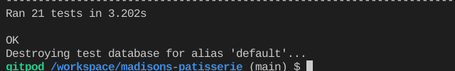

#### Links

* Ensure the external links to social media present in the footer open up in new tabs.

## Automated View Testing
### Test Overview

* **Home App** 
Tests applied for user stories: **#1, #2 #7** 
  

* **Products App** 
Tests applied for user stories: **#10, #11, #12** 
  

* **Bag App** 
Tests applied for user stories: **#15, #16** 
  

* **Checkout App** 
Tests applied for user stories: **#17, #18, #22** 
  

* **Product Reviews App** 
Tests applied for user stories: **#13, #11** 
  

* **Wishlist App** 
Tests applied for user stories: **#19, #14** 
  

* **Profiles App** 
Tests applied for user stories: **#19, #20, #21** 
  

* **Vouchers App** 
Tests applied for user stories: **#22** 
  

* **Newsletter App** 
Tests applied for user stories: **#8** 
  

### Test Coverage
For generating a report with the coverage of the automated tests, [coverage](https://coverage.readthedocs.io/en/coverage-5.5/) module was used. 
Full coverage results:  
  
  

## BUGS
### Solved
* ** Duplicate key error. 
     When I added the unique attribute on sku and code fields (to ensure that all the products skus and codes are unique and therefore will prevent error of duplication for future data entries), I got the duplicate key error. I found this bug significantly challenging as I have never encountered it from previous problem. And also because this is my first experience implementing fixtures file on a project, this bug had been so challenging but at the same time a great learning experience.
     Solution:
     After research and tutor and mentor consultation, I reset my database. Make migrations again. Create a new superuser. And reload data again.

* ** Stripe Element not working as expected.
     When I implemented stripe payments and try to check that everything works, I could only go as far as 'Complete Order' but it wouldn't bring me to success checkout page as expected.
     Solution:
     It turns out that I am using the slim version of JQuery which doesn't support fadeToggle. By switching to normal minified version, the issue was fixed.

### Unsolved